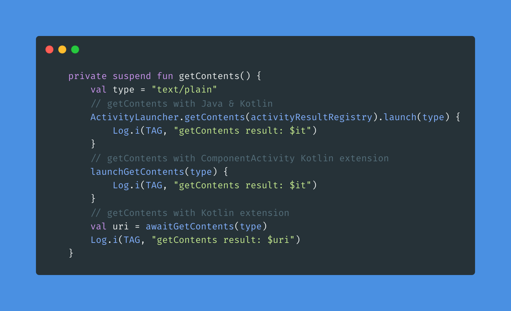

# README



## 背景

想要启动一个 Activity，并且需要知道其处理的结果时候，我们一般会这么写：

```kotlin
class MainActivity : AppCompatActivity() {

    companion object {
        const val REQUEST_CODE = 1
    }

    override fun onCreate(savedInstanceState: Bundle?) {
        super.onCreate(savedInstanceState)
	      // ...
				val intent = Intent(Intent.ACTION_GET_CONTENT)
            .addCategory(Intent.CATEGORY_OPENABLE)
            .setType("image/*")
        startActivityForResult(intent, REQUEST_CODE)
    }

    override fun onActivityResult(requestCode: Int, resultCode: Int, data: Intent?) {
        super.onActivityResult(requestCode, resultCode, data)
        if (requestCode != REQUEST_CODE) return
        
        if (resultCode == RESULT_OK) {
            // 处理返回成功的情况
        } else if (resultCode == RESULT_CANCELED) {
            // 处理取消的情况
        }
    }
}
```

这种写法会有几个问题：

1. 调用逻辑与结果回调不在同一个地方，逻辑比较割裂，不易维护；
2. 如果当前 Activity 中有多个返回结果的时候，会存在 `requestCode` 与 `resultCode` 双层嵌套的问题，不易维护；
3. 如有多处需要启动对应的 Activity，那么 `Intent` 的构造以及结果处理的逻辑就会有多份，存在重复代码；

为了优化上述问题，官方给出了新的解决方案，如下：

```kotlin
class MainActivity : AppCompatActivity() {

    val getContent = registerForActivityResult(ActivityResultContracts.GetContent()) { uri: Uri? ->
        // 处理返回的数据
    }

    override fun onCreate(savedInstanceState: Bundle?) {
        super.onCreate(savedInstanceState)
				// ...
        val selectButton = findViewById<Button>(R.id.select_button)
        selectButton.setOnClickListener {
            // 跳转到对应的 Activity 中
            getContent.launch("image/*")
        }
    }
}
```

上述代码虽然解决了部分问题，但是仍然会有调用与结果处理不在同一处的情况，对代码的可读性有一定的影响。

为了解决上述问题，特封装此库，使用非常简单：

```kotlin
class MainActivity : AppCompatActivity() {

    override fun onCreate(savedInstanceState: Bundle?) {
        super.onCreate(savedInstanceState)
        // ...

        ActivityLauncher.getContents(activityResultRegistry).launch("image/*") { uri: Uri? ->
            // 处理返回的数据
        }
    }
}
```

基本是一行代码搞定。

## 使用

### 添加依赖

```kotlin
dependencies {
		// ...

    implementation("com.madroid.activity:launcher:${last_version}")
}
```

### 基本使用

```kotlin
private fun getContents() {
    ActivityLauncher.getContents(activityResultRegistry).launch("") { uri: Uri? ->
        // Handle the returned Uri
    }
}
```

也对 Activity、Fragment 中添加了一些扩展函数，以简化上面的写法，如下：

```kotlin
private fun getContents() {
    launchGetContents(type, null) {
        // Handle the returned Uri
    }
}
```

### 自定义 ActivityResultContract
